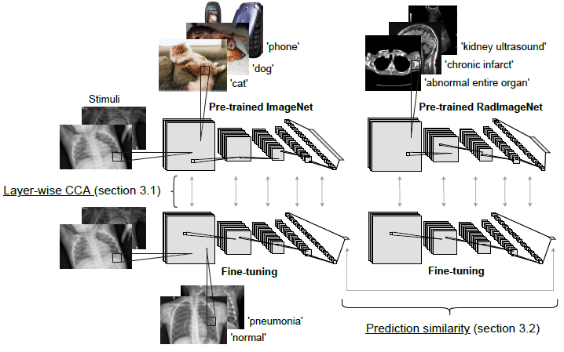

# Revisiting Hidden Representations in Transfer Learning for Medical Imaging

This repository contains the code and results included in the paper

Transfer learning has become an increasingly popular approach in medical imaging, as it offers a solution to the challenge of training models with limited dataset sizes. Despite its widespread use, the precise effects of transfer learning on medical image classification are still heavily understudied. We set out to investigate this with a series of systematic experiments on the difference of representations learned from natural (ImageNet) and medical (RadImageNet) source datasets on a range of (seven) medical targets.

## Project structure

This project consists of two parts: 

* Fine-tuning natural and medical image sources on medical image classification targets, and
* Experiments on model similarity.



### Fine-tuning

We use publicly available pre-trained ImageNet (Keras implementation of ResNet50) and RadImageNet (https://drive.google.com/drive/folders/1Es7cK1hv7zNHJoUW0tI0e6nLFVYTqPqK?usp=sharing) weights as source tasks in our transfer learning experiments.

We investigate transferability to seven medical target datasets:
1. [Chest X-rays](https://www.kaggle.com/paultimothymooney/chest-xray-pneumonia)
2. [PatchCamelyon](http://basveeling.nl/posts/pcam/)
3. [Curated Breast Imaging Subset of Digital Database for Screening Mammography (CBIS-DDSM)](https://wiki.cancerimagingarchive.net/pages/viewpage.action?pageId=22516629)
4. [ISIC2018 - Task 3 - the training set](https://challenge2018.isic-archive.com/task3/training/)
5. [Thyroid ultrasound](https://www.kaggle.com/datasets/dasmehdixtr/ddti-thyroid-ultrasound-images)
6. [Breast ultrasound](https://www.kaggle.com/datasets/aryashah2k/breast-ultrasound-images-dataset)
7. [ACL and meniscus tear detection](https://stanfordmlgroup.github.io/competitions/mrnet/)

#### Usage

Our fine-tuning experiments and models were logged on a private server using [MLflow](https://www.mlflow.org/). Update looging in fine-tuning.py.

Specific paths to the different datasets are to be set in io_fun/data_paths.py. Data is split to folds in make_dataframe.py. To fine-tune pre-trained RadImageNet weights on eg. Chest X-rays run:

```shell script
python src/fine-tuning.py --base RadImageNet --t chest --image_h 112 --image_w 112 --freeze False --e 200 --k 1 --batch 128 --l 0.00001
```
To first freeze the pre-trained weights and then fine-tune after training the classification layer set --freeze to True. 

### Model similarity

Model similarity is assesed by comparing the network activations over a sample of images from the target datasets using two similarity measures, Canonical
Correlation Analysis (CCA) and prediction similarity. We use publibly available [CCA implamentation](https://github.com/google/svcca) which should be placed at the same level locally as src/. Model similarity can be evaluated using CCA.py and prediction_similarity.py after placing fine-tuned models locally in a directory next to src/. Figures in the paper can be reproduced using CCA_plot.py, filter_plot.py, similarity_plot.py, and simVSauc_plot.py.
